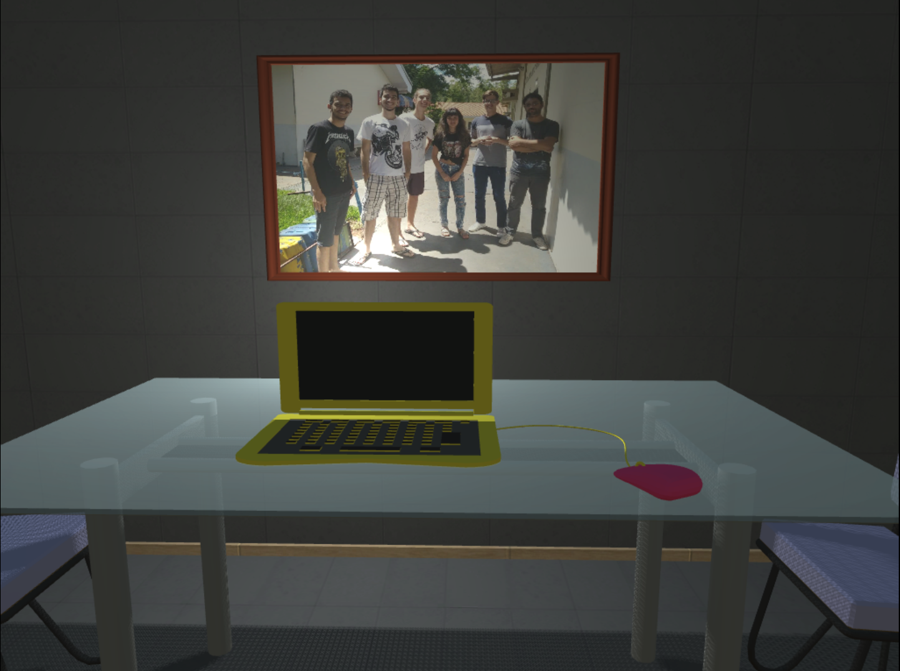
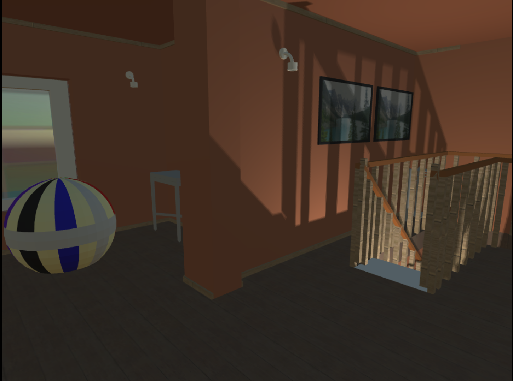

🏠 Where I Belong  Narrative Game | Global Game Jam 2019  Where I Belong é um jogo narrativo desenvolvido durante a Global Game Jam 2019, focado em narrativa ambiental, memória e pertencimento. A experiência convida o jogador a revisitar uma antiga casa, reconstruindo fragmentos do passado por meio do espaço, do silêncio e da interação.  Este projeto é parte do meu portfólio profissional e demonstra minha atuação prática em Game Design, Programação e Level Design, desde a concepção até a implementação final.  🎯 Objetivo do Projeto  Criar uma experiência curta e emocionalmente envolvente que explorasse:  Narrativa não verbal  Ritmo contemplativo  Storytelling ambiental  Interpretação subjetiva do jogador  Tudo isso respeitando as limitações de tempo e escopo de uma Game Jam.  🧠 Minhas Atividades no Projeto  🎮 Game Design  Definição do fluxo do jogador e ritmo da experiência  Aplicação de narrativa ambiental como principal meio de storytelling  Integração dos diversificadores da GGJ às decisões de design  Balanceamento entre interação, silêncio e observação  🗺️ Level Design  Planejamento e construção dos ambientes da casa  Organização espacial para guiar o jogador sem uso de texto  Uso de iluminação, objetos e composição para reforçar emoções e memória  Criação de uma progressão narrativa baseada na exploração do espaço  💻 Programação  Implementação das mecânicas de interação  Controle de eventos narrativos e gatilhos ambientais  🧩 Diversificadores Aplicados (GGJ 2019)  Language-Independence (Valve Software) → Narrativa construída sem dependência de texto ou idioma  Mind Over Matter → Ênfase em percepção, memória e interpretação  4′33″ → Uso consciente do silêncio como elemento narrativo  Ephemeral → Sensação de momentos únicos e transitórios  Esses elementos influenciaram diretamente decisões de design, ritmo e interação.  🛠️ Tecnologias Utilizadas  Engine: Unity  Programação: C#  Modelagem 3D: Blender  Arte 2D / Interface: CorelDraw, Krita  ▶️ Execução do Jogo  Faça o download do build disponível na pasta build/  Descompacte o arquivo  Abra a pasta extraída  Execute o arquivo Where I Belong  📸 Imagens e Vídeos       👥 Equipe  Projeto desenvolvido em equipe durante a Global Game Jam 2019:  Thiago de Ataide Orlandini  Ulisses Mignon  Gustavo Henrique Bertola da Silva  Arthur Francisco Aguiar Figueiredo  Leandro Donizetti Carvalho Bellei  Nicole Kiyan de Oliveira Campos  🌍 Global Game Jam  Evento: Global Game Jam 2019  Jam Site: Fatec Ourinhos  Página Oficial: https://v3.globalgamejam.org/2019/games/where-i-belong-0  📌 Sobre este Repositório  Este repositório existe com fins de portfólio profissional, com o objetivo de demonstrar:  Capacidade de trabalhar sob restrições de tempo  Integração entre design, programação e narrativa  Pensamento sistêmico aplicado a jogos  Experiência prática em desenvolvimento de jogos narrativos  🧠 Principais Aprendizados  Narrativa pode emergir do espaço, não apenas do texto  Level design é uma ferramenta poderosa de storytelling  Restrições criativas amplificam decisões conscientes de design  Jogos pequenos podem carregar grandes emoções  ✨ Por que este projeto importa no meu portfólio  Where I Belong representa minha abordagem de desenvolvimento: jogos como experiências significativas, onde técnica, design e narrativa caminham juntas.

