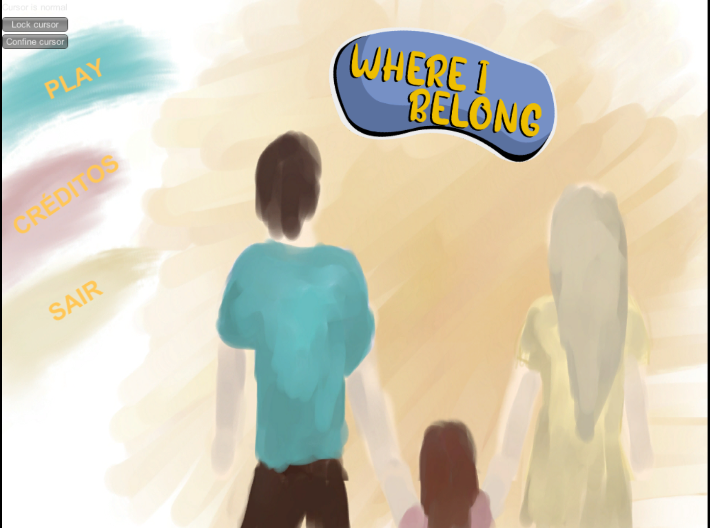

🏠 Where I Belong

Narrative Game | Global Game Jam 2019

Where I Belong é um jogo narrativo desenvolvido durante a Global Game Jam 2019, focado em narrativa ambiental, memória e pertencimento.
A experiência convida o jogador a revisitar uma antiga casa, reconstruindo fragmentos do passado por meio do espaço, do silêncio e da interação.

Este projeto é parte do meu portfólio profissional e demonstra minha atuação prática em Game Design, Programação e Level Design, desde a concepção até a implementação final.

🎯 Objetivo do Projeto

Criar uma experiência curta e emocionalmente envolvente que explorasse:

Narrativa não verbal

Ritmo contemplativo

Storytelling ambiental

Interpretação subjetiva do jogador

Tudo isso respeitando as limitações de tempo e escopo de uma Game Jam.

🧠 Minhas Atividades no Projeto
🎮 Game Design

Definição do fluxo do jogador e ritmo da experiência

Aplicação de narrativa ambiental como principal meio de storytelling

Integração dos diversificadores da GGJ às decisões de design

Balanceamento entre interação, silêncio e observação

🗺️ Level Design

Planejamento e construção dos ambientes da casa

Organização espacial para guiar o jogador sem uso de texto

Uso de iluminação, objetos e composição para reforçar emoções e memória

Criação de uma progressão narrativa baseada na exploração do espaço

💻 Programação

Implementação das mecânicas de interação

Controle de eventos narrativos e gatilhos ambientais

🧩 Diversificadores Aplicados (GGJ 2019)

Language-Independence (Valve Software)
→ Narrativa construída sem dependência de texto ou idioma

Mind Over Matter
→ Ênfase em percepção, memória e interpretação

4′33″
→ Uso consciente do silêncio como elemento narrativo

Ephemeral
→ Sensação de momentos únicos e transitórios

Esses elementos influenciaram diretamente decisões de design, ritmo e interação.

🛠️ Tecnologias Utilizadas

Engine: Unity

Programação: C#

Modelagem 3D: Blender

Arte 2D / Interface: CorelDraw, Krita

▶️ Execução do Jogo

Faça o download do build disponível na pasta build/

Descompacte o arquivo

Abra a pasta extraída

Execute o arquivo Where I Belong

📸 Imagens e Vídeos

(docs/screenshots/screenshot_02.png)(docs/screenshots/screenshot_03.png)

👥 Equipe

Projeto desenvolvido em equipe durante a Global Game Jam 2019:

Thiago de Ataide Orlandini

Ulisses Mignon

Gustavo Henrique Bertola da Silva

Arthur Francisco Aguiar Figueiredo

Leandro Donizetti Carvalho Bellei

Nicole Kiyan de Oliveira Campos

🌍 Global Game Jam

Evento: Global Game Jam 2019

Jam Site: Fatec Ourinhos

Página Oficial:
https://v3.globalgamejam.org/2019/games/where-i-belong-0

📌 Sobre este Repositório

Este repositório existe com fins de portfólio profissional, com o objetivo de demonstrar:

Capacidade de trabalhar sob restrições de tempo

Integração entre design, programação e narrativa

Pensamento sistêmico aplicado a jogos

Experiência prática em desenvolvimento de jogos narrativos

🧠 Principais Aprendizados

Narrativa pode emergir do espaço, não apenas do texto

Level design é uma ferramenta poderosa de storytelling

Restrições criativas amplificam decisões conscientes de design

Jogos pequenos podem carregar grandes emoções

✨ Por que este projeto importa no meu portfólio

Where I Belong representa minha abordagem de desenvolvimento:
jogos como experiências significativas, onde técnica, design e narrativa caminham juntas.
